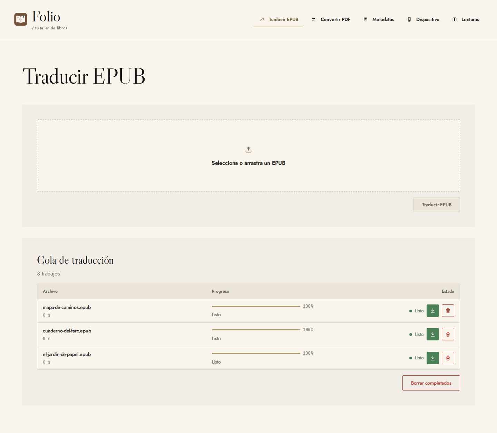
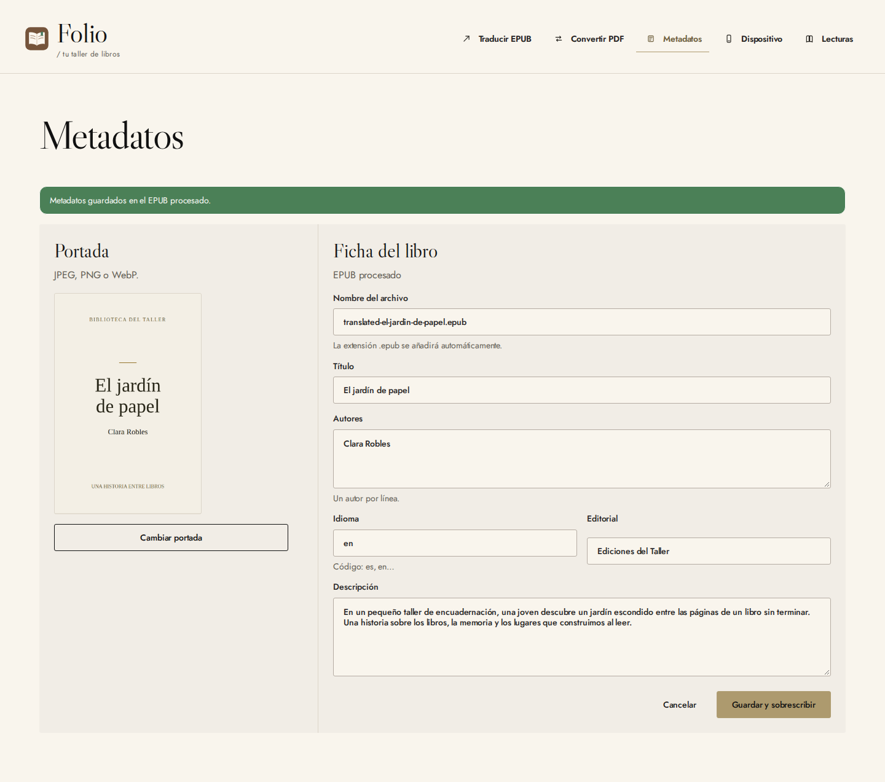

<div align="center">
  
  <h1>Folio</h1>
  <p><strong>Translate, prepare, and organize your ebooks — in one personal book workshop.</strong></p>
  <p>
    
    
    
    
  </p>
</div>

Folio is a self-hosted web application for preparing and managing a personal ebook
library. Translate English EPUBs into Spanish, convert PDFs into EPUBs, edit book
metadata and covers, transfer books to an ereader, and keep a record of your reading.

The React interface runs in your browser and talks to a Fastify API. Jobs, processed
books, and reading history stay on the server you run. There is no Folio account or
hosted Folio service; remote translation and PDF processing use the providers you
configure.

> [!NOTE]
> Folio is under active development. The current interface is in Spanish. The three
> screenshots below show the actual application with fictional books and reading data.

## What Folio does

- Translates English EPUB content into Spanish through a configured language model.
- Keeps EPUB translation jobs in a persistent queue with progress, pause, resume,
  and queue-order controls.
- Converts PDFs into downloadable EPUBs using either OpenRouter or local processing.
- Edits EPUB and PDF metadata, including title, authors, language, and description.
- Replaces EPUB covers and edits books already processed by Folio.
- Downloads updated files or overwrites a local file when the browser grants permission.
- Discovers and transfers books through supported server-side device connections
  or a configured device bridge.
- Searches book catalogues and keeps reading statuses, dates, ratings, notes,
  and categories in a persistent reading log.
- Serves the web application and API from the same origin, with an optional
  shared-nginx deployment for a trusted local network.

## Screenshots

### EPUB translation

Upload a book, follow its processing status, and download or edit the finished EPUB.



### Metadata and cover editing

Review a processed book's cover and edit its title, authors, language, publisher,
file name, and description before saving it.



### Reading log

Keep a personal reading history with books grouped by reading month, ratings,
statuses, and categories.


These captures were made with Playwright against the compiled web app and real
Fastify API, using isolated temporary storage. Translation used the application's
mock-provider mode; the sample books and cover were created for these screenshots.
No personal library, real credentials, or physical device was used.

## Requirements

### To use Folio

- A modern browser and access to the server running Folio.
- A configured language-model provider for real EPUB translation.
- OpenRouter credentials for remote PDF conversion, or the local conversion tools.
- A supported device connection or device bridge for ereader transfers.

Folio is a personal tool without accounts or authentication. If you expose it
beyond a trusted local network, control access at the server or reverse proxy.

Browser-based overwriting of local files requires File System Access support and
a secure context, such as HTTPS or localhost. Otherwise, you can upload a file and
download an updated copy.

### To develop Folio

- Node.js 24.
- pnpm 10.0.0, pinned in `package.json` and available through Corepack.
- Chromium installed through Playwright for E2E tests.

Local OCR uses `pdftoppm` from Poppler and Tesseract language data. GIO handles
Linux MTP connections, and Calibre may be needed for Kindle transfers. The API's
Docker image includes Poppler and Calibre.

The office deployment additionally requires Docker with BuildKit and Compose,
a running nginx service on Ubuntu, and administrator access to install the site
configuration and compiled web files.

## Using Folio

### Translate an EPUB

Open **Traducir EPUB**, select or drop an English `.epub` file, and start the
translation. The jobs table shows progress and provides the available controls
for pausing, resuming, and managing the queue.

When processing finishes, download the output or open the book's metadata editor.
Jobs and outputs are stored on the server, so finished books remain available
when you return to the application.

The supplied `.env.example` enables `LLM_MOCK=true` for development. Set it to
`false` and configure the provider to produce real translations. Mock mode is
for testing the workflow, not evaluating translation quality.

### Convert a PDF

Open **Convertir PDF**, select a PDF, and start conversion. A completed job produces
an EPUB that you can download or edit.

`PDF_CONVERSION_PROVIDER=openrouter` sends PDF batches through OpenRouter and
builds the EPUB locally. Its model is configured independently from the EPUB
translation model. `PDF_CONVERSION_PROVIDER=local` uses the local PDF.js and
Tesseract pipeline instead. Provider failures do not silently switch to local
conversion, and `LLM_MOCK` does not make OpenRouter PDF conversion free.

See the [PDF conversion guide](docs/pdf-conversion.md) for processing engines,
limits, OCR configuration, and quality considerations.

### Edit metadata and covers

Open **Metadatos** to select an EPUB or PDF, or open a processed book from its jobs
table. Change the supported fields and replace the cover when editing an EPUB.
For PDFs, the first page serves as the cover.

Files selected with browser write permission can be overwritten. Other local
uploads produce an updated download. Processed books and books on a configured
device are edited through the API. Check the save action to see which file will
be updated.

### Transfer books to an ereader

Open **Dispositivo** to inspect supported devices and transfer prepared books.
The browser does not access USB or MTP devices directly: detection and transfers
run on the server or through the device bridge.

Use `EBOOK_DEVICE_ROOTS` for readers connected to the server. To run the bridge
on a supported host:

```bash
pnpm dev:device-bridge
```

Configure the API's `DEVICE_BRIDGE_URL` and keep `DEVICE_BRIDGE_TOKEN` consistent
between the API and bridge. On Linux, [the user service](systemd/folio-device-bridge.service)
can keep the bridge running independently of the browser.

### Keep a reading log

Open **Lecturas**, search for a book, and add it to your log. Edit a saved entry to
set its status, reading month, rating, notes, and categories. The log persists in
SQLite and groups books by their recorded reading month.

Catalogue searches use external book services; already saved reading entries are
stored locally on the server.

## Development

Clone the repository and install dependencies from its root:

```bash
git clone https://github.com/megara-arevaco/folio.git
cd folio
corepack enable
pnpm install --frozen-lockfile
cp .env.example .env
pnpm dev
```

Open `http://localhost:5173`. One command starts Vite and Fastify with automatic
reload. You can also run `pnpm dev:api` and `pnpm dev:web` separately. Vite proxies
`/api` requests to the backend on port `3001`.

For real translation, configure `.env`:

```dotenv
LLM_API_BASE_URL=https://openrouter.ai/api/v1
LLM_API_KEY=your_openrouter_key
LLM_MODEL=your_translation_model
LLM_MOCK=false
```

For local PDF conversion, explicitly select:

```dotenv
PDF_CONVERSION_PROVIDER=local
```

For OpenRouter PDF conversion, set `PDF_CONVERSION_PROVIDER=openrouter` and choose
an appropriate `PDF_OPENROUTER_MODEL`. The API reuses `LLM_API_BASE_URL` and
`LLM_API_KEY`; these credentials are never sent to the browser.

The server loads `.env` from its working directory. `FOLIO_ENV_FILE` selects a
different configuration file, and environment variables take precedence. Restart
the API after changing configuration. If a Docker deployment supplies those
variables, recreate its API service to apply changes.

Validate changes before committing:

```bash
pnpm exec playwright install chromium
pnpm check
```

`check` runs the architecture check, TypeScript, E2E tests, and builds. `test` and
`test:e2e` build the app and run headless Chromium against the real Fastify API with
temporary data. The suite covers navigation, mock translation, local PDF conversion,
metadata editing and downloads, reading-log edits, persistence, and invalid input.
It does not require paid providers or physical devices.

Failure screenshots and traces are saved in `test-results/`; the HTML report is
in `playwright-report/`. Open it with:

```bash
pnpm exec playwright show-report
```

## Running the built application

```bash
pnpm build
pnpm start
```

Open `http://127.0.0.1:3001`. Fastify serves both the compiled web app and API,
including direct navigation to application routes. `HOST` and `PORT` control the
listener. If an HTTPS reverse proxy changes the browser origin, add that origin
to the comma-separated `FOLIO_ALLOWED_ORIGINS` setting.

## Running with Docker

```bash
docker compose up --build -d
```

Open `http://localhost:3001`. The Compose configuration reads provider settings
from `.env` and keeps SQLite, job state, and books in the `folio_data` volume,
mounted at `/data` inside the container. Host-connected readers require their
own device bridge configuration.

```bash
docker compose ps
docker compose logs --tail=100
docker compose stop
docker compose up -d
```

The application has no accounts or authentication. Control access to the server
when exposing it beyond your own machine. For HTTPS behind a reverse proxy,
configure `FOLIO_ALLOWED_ORIGINS` as described above.

**`docker compose down --volumes` deletes the stored data.** Back up the persistent
volume before changing or removing a deployment.

## Project structure

```text
folio/
├── apps/web/              React interface, components, and HTTP clients
├── apps/api/              Fastify routes, processing services, and persistence
├── packages/contracts/    Shared public types and input validation
├── tests/e2e/             Playwright tests with isolated server data
├── scripts/               Development, builds, and device bridge
├── systemd/               Optional Linux device-bridge user service
├── docs/screenshots/      Three application captures with fictional sample data
├── compose.yaml           Application service and persistent data volume
└── package.json           Commands and pinned package manager
```

See [architecture](docs/architecture.md) for the layer boundaries,
[PRODUCT.md](PRODUCT.md) for the current scope, and [SPEC_FOLIO.md](SPEC_FOLIO.md)
for the original translation specification.

## Data locations and privacy

Set `FOLIO_DATA_DIR` to choose the server's data directory. The example uses
`./data`, which contains `reading-log.sqlite`, `jobs/`, and `books/`. Docker mounts
its persistent volume at `/data`.

`JOBS_TMP_ROOT`, `OUTPUT_DIR`, `READING_DB_PATH`, and `READING_LOG_PATH` allow
existing data locations to be reused. Without `FOLIO_DATA_DIR`, the server retains
its legacy path defaults. Do not move jobs while they are still processing.

Local metadata editing uses the browser's upload or file-access capabilities.
Remote translation sends text to the configured model provider; remote PDF
conversion sends PDF content to OpenRouter. Catalogue searches contact external
book services. Device operations use the configured server-side connection or
bridge. Keep those data flows in mind when processing private documents.

Environment files, credentials, runtime data, processed books, backups, and generated
E2E reports are excluded from version control.
